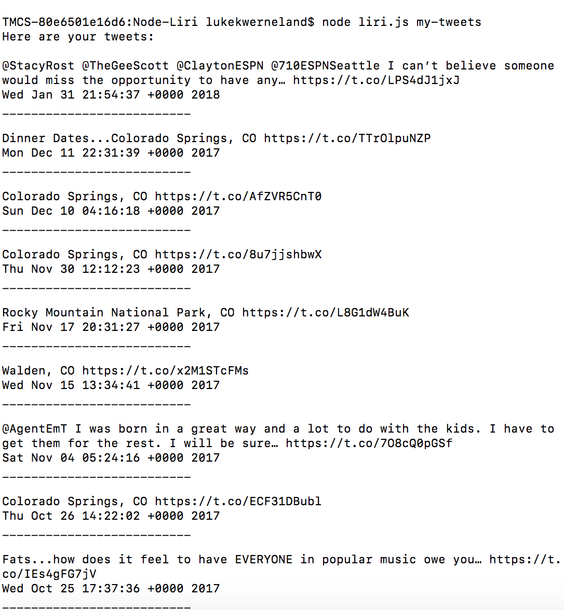
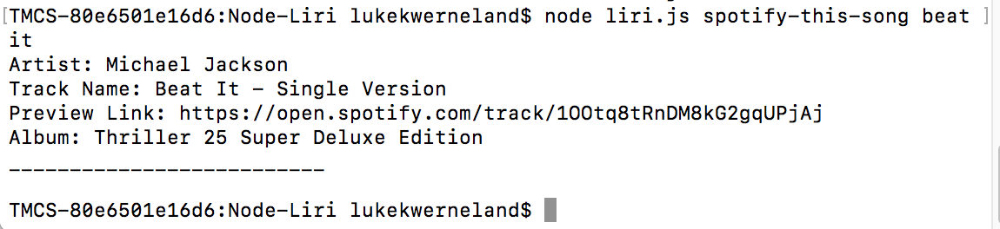
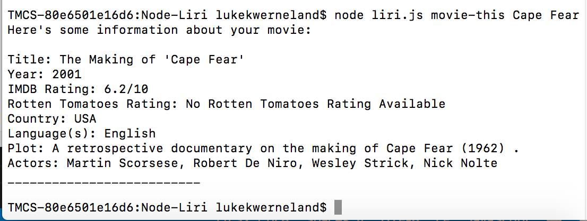
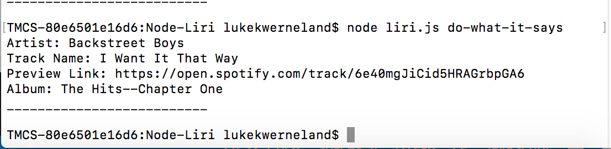

# Node-Liri

L.I.R.I. stands for Language Interpretation and Recognition Interface. It is a command line node.js app that takes in parameters and gives back data from various APIs.

LIRI is similar to the iPhone's SIRI assistant, but rather than using speech, LIRI responds to written text.

LIRI uses Node.js in the command line of your computer and has dependencies for the request, keys, twitter, spotify, and dotenv Node.js packages. It also used the built-in fs package to read and write to text files.

The app features 4 different features using the node liri.js [command-here] syntax. Below are the command types...

"my-tweets":

"spotify-this-song":

"movie-this": 

"do-what-it-says":

